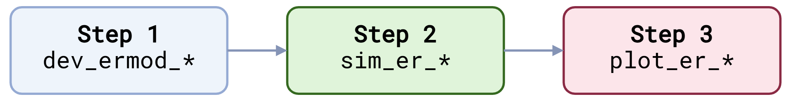
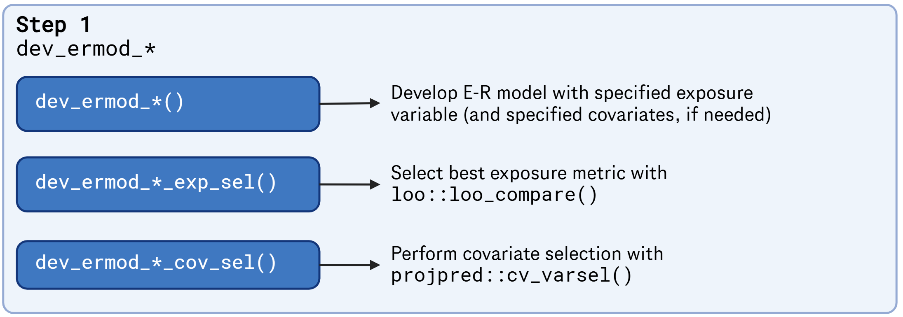
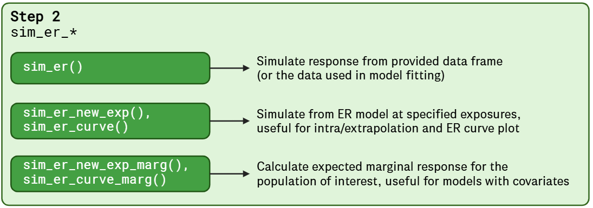
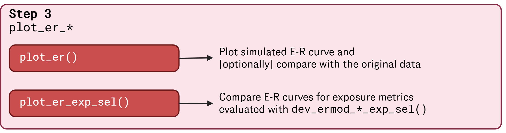

# 0. Overview of the package

This vignette provides an overview of `BayesERtools`.

## 0. Analysis workflow & supported model types

Analysis can be performed in the following simple steps.

  

Supported model types are as follows:

[TABLE]

## 1. ER model development

The package provides a set of functions to develop ER models. The
following functions are available:  
  

**Binary endpoint**

- Linear logistic regression:
  - [`dev_ermod_bin()`](https://genentech.github.io/BayesERtools/reference/dev_ermod_bin.md),
    [`dev_ermod_bin_exp_sel()`](https://genentech.github.io/BayesERtools/reference/dev_ermod_bin_exp_sel.md),
    [`dev_ermod_bin_cov_sel()`](https://genentech.github.io/BayesERtools/reference/dev_ermod_bin_cov_sel.md)
- E_(max) logistic regression:
  - [`dev_ermod_bin_emax()`](https://genentech.github.io/BayesERtools/reference/dev_ermod_emax.md),
    [`dev_ermod_bin_emax_exp_sel()`](https://genentech.github.io/BayesERtools/reference/dev_ermod_emax_exp_sel.md)

**Continuous endpoint**

- Linear regression:
  - [`dev_ermod_lin()`](https://genentech.github.io/BayesERtools/reference/dev_ermod_bin.md),
    [`dev_ermod_lin_exp_sel()`](https://genentech.github.io/BayesERtools/reference/dev_ermod_bin_exp_sel.md),
    [`dev_ermod_lin_cov_sel()`](https://genentech.github.io/BayesERtools/reference/dev_ermod_bin_cov_sel.md)
- E_(max) model:
  - [`dev_ermod_emax()`](https://genentech.github.io/BayesERtools/reference/dev_ermod_emax.md),
    [`dev_ermod_emax_exp_sel()`](https://genentech.github.io/BayesERtools/reference/dev_ermod_emax_exp_sel.md)

  

## 2. Simulation from developed ER model

The following functions are available for simulation from developed ER
models:

- [`sim_er()`](https://genentech.github.io/BayesERtools/reference/sim_er.md)
- [`sim_er_new_exp()`](https://genentech.github.io/BayesERtools/reference/sim_er_new_exp.md),
  [`sim_er_curve()`](https://genentech.github.io/BayesERtools/reference/sim_er_new_exp.md)
- [`sim_er_new_exp_marg()`](https://genentech.github.io/BayesERtools/reference/sim_er_new_exp_marg.md),
  [`sim_er_curve_marg()`](https://genentech.github.io/BayesERtools/reference/sim_er_new_exp_marg.md)

  

## 3. Plot simulated ER curve

Simulated ER curve can be visualized with the following functions:

- [`plot_er()`](https://genentech.github.io/BayesERtools/reference/plot_er.md)
- [`plot_er_exp_sel()`](https://genentech.github.io/BayesERtools/reference/plot_er_exp_sel.md)

  

## Acknowledgement

Figures created with <https://www.biorender.com>
