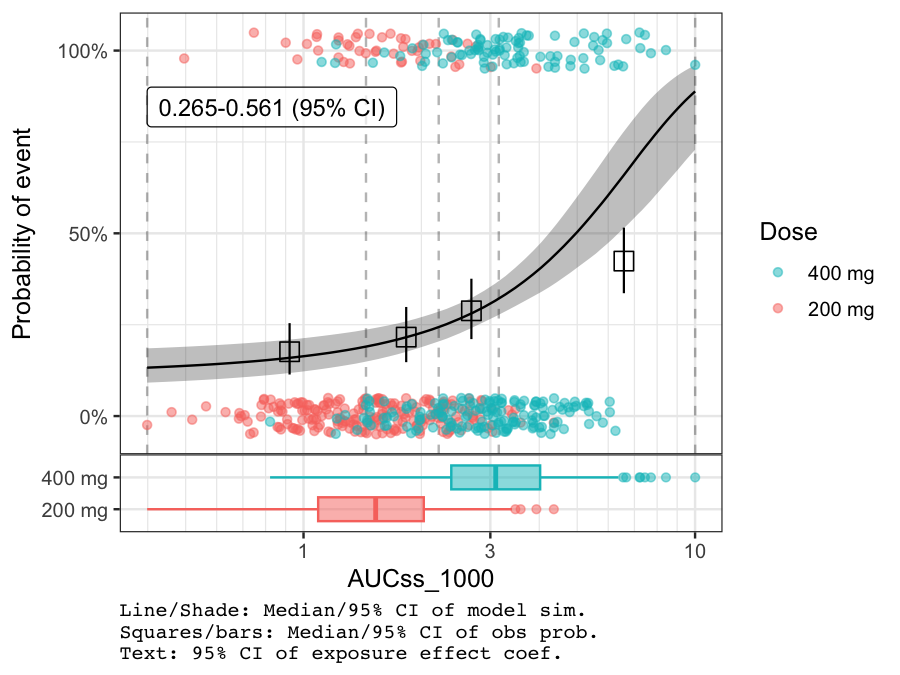
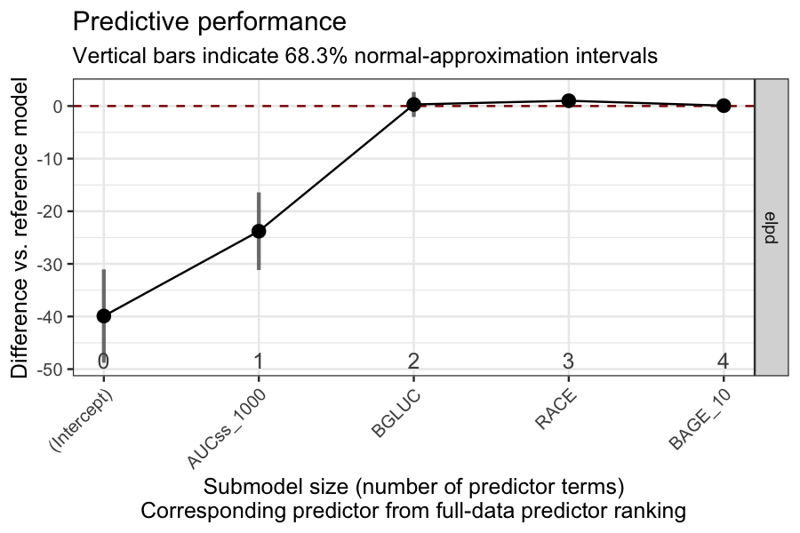
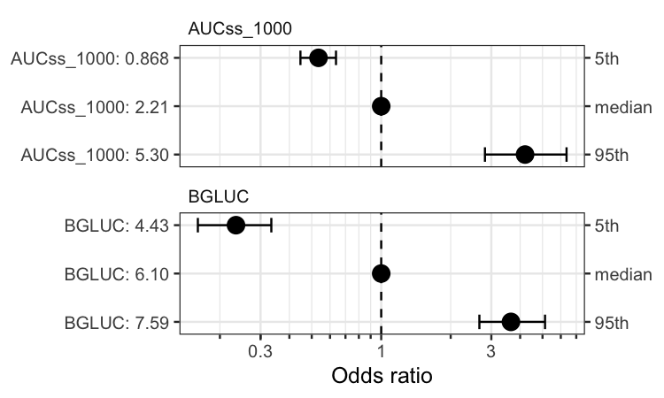

# BayesERtools

`BayesERtools` provides a suite of tools that facilitate
exposure-response analysis using Bayesian methods.

- Tutorial (`BayesERbook`): <https://genentech.github.io/BayesERbook/>
- Package documentation: <https://genentech.github.io/BayesERtools/>
- GitHub repo of the package:
  <https://github.com/genentech/BayesERtools/>

## Installation

You can install the `BayesERtools` with:

``` r
install.packages('BayesERtools')
# devtools::install_github("genentech/BayesERtools") # development version
```

## Supported model types

[TABLE]

## Quick guide

Here is a quick demo on how to use this package for E-R analysis. See
[Basic
workflow](https://genentech.github.io/BayesERbook/notebook/binary/basic_workflow.html)
for more thorough walk through.

``` r
# Load package and data
library(dplyr)
library(BayesERtools)
ggplot2::theme_set(ggplot2::theme_bw(base_size = 12))

data(d_sim_binom_cov)

# Hyperglycemia Grade 2+ (hgly2) data
df_er_ae_hgly2 <-
  d_sim_binom_cov |>
  filter(AETYPE == "hgly2") |>
  # Re-scale AUCss, baseline age
  mutate(
    AUCss_1000 = AUCss / 1000, BAGE_10 = BAGE / 10,
    Dose = paste(Dose_mg, "mg")
  )

var_resp <- "AEFLAG"
```

### Simple univariable model for binary endpoint

``` r
set.seed(1234)
ermod_bin <- dev_ermod_bin(
  data = df_er_ae_hgly2,
  var_resp = var_resp,
  var_exposure = "AUCss_1000"
)
ermod_bin
#> 
#> ── Binary ER model ─────────────────────────────────────────────────────────────
#> ℹ Use `plot_er()` to visualize ER curve
#> 
#> ── Developed model ──
#> 
#> stan_glm
#>  family:       binomial [logit]
#>  formula:      AEFLAG ~ AUCss_1000
#>  observations: 500
#>  predictors:   2
#> ------
#>             Median MAD_SD
#> (Intercept) -2.04   0.23 
#> AUCss_1000   0.41   0.08 
#> ------
#> * For help interpreting the printed output see ?print.stanreg
#> * For info on the priors used see ?prior_summary.stanreg

# Using `*` instead of `+` so that scale can be
# applied for both panels (main plot and boxplot)
plot_er_gof(ermod_bin, var_group = "Dose", show_coef_exp = TRUE) *
  xgxr::xgx_scale_x_log10(guide = ggplot2::guide_axis(minor.ticks = TRUE))
#> Warning in ggplot2::annotate("label", x = pos_ci_annot[1], y = pos_ci_annot[2],
#> : Ignoring unknown parameters: `label.size`
#> Warning: annotation$theme is not a valid theme.
#> Please use `theme()` to construct themes.
```



### Covariate selection

BGLUC (baseline glucose) is selected while other two covariates are not.

``` r
set.seed(1234)
ermod_bin_cov_sel <-
  dev_ermod_bin_cov_sel(
    data = df_er_ae_hgly2,
    var_resp = var_resp,
    var_exposure = "AUCss_1000",
    var_cov_candidate = c("BAGE_10", "RACE", "BGLUC")
  )
#> 
#> ── Step 1: Full reference model fit ──
#> 
#> ── Step 2: Variable selection ──
#> 
#> ℹ The variables selected were: AUCss_1000, BGLUC
#> 
#> ── Step 3: Final model fit ──
#> 
#> ── Cov mod dev complete ──
#> 
ermod_bin_cov_sel
#> ── Binary ER model & covariate selection ───────────────────────────────────────
#> ℹ Use `plot_submod_performance()` to see variable selection performance
#> ℹ Use `plot_er()` with `marginal = TRUE` to visualize marginal ER curve
#> 
#> ── Selected model ──
#> 
#> stan_glm
#>  family:       binomial [logit]
#>  formula:      AEFLAG ~ AUCss_1000 + BGLUC
#>  observations: 500
#>  predictors:   3
#> ------
#>             Median MAD_SD
#> (Intercept) -7.59   0.90 
#> AUCss_1000   0.46   0.08 
#> BGLUC        0.87   0.13 
#> ------
#> * For help interpreting the printed output see ?print.stanreg
#> * For info on the priors used see ?prior_summary.stanreg
plot_submod_performance(ermod_bin_cov_sel)
```



``` r
coveffsim <- sim_coveff(ermod_bin_cov_sel)
plot_coveff(coveffsim)
#> Warning in geom_errorbar(..., orientation = orientation): Ignoring unknown
#> parameters: `height`
```


